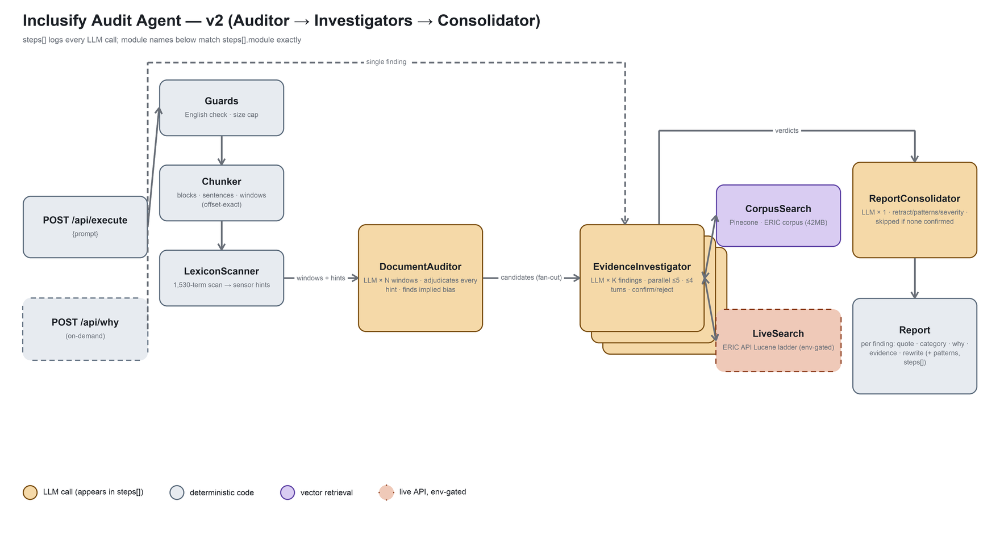

# Inclusify Audit Agent

Inclusify is an autonomous curriculum-inclusivity auditor for higher education: it reads
human-written **English** academic text — papers, syllabi, slides — and audits it end to end on an
orchestrator-workers pipeline (LangGraph `Send`, offline-first by default). A **DocumentAuditor**
reads the whole document window by window and proposes candidate spans, including implied bias with
no trigger word. Parallel **EvidenceInvestigators** then research each candidate against a retrieval
corpus (CorpusSearch) and, when local evidence is weak, the live ERIC API (LiveSearch), confirming or
rejecting it with a grounded explanation and an inclusive rewrite. A final **ReportConsolidator**
retracts contradicted or duplicate findings, groups recurring patterns, and orders findings by
severity — every finding is a quote · category · grounded why · evidence · rewrite tuple.

> Design: [`docs/PRD.md`](docs/PRD.md) · Build plan: [`docs/BUILD_PLAN.md`](docs/BUILD_PLAN.md) ·
> Needs-keys: [`docs/NEEDS_KEYS.md`](docs/NEEDS_KEYS.md) · Deploy: [`docs/DEPLOY.md`](docs/DEPLOY.md)



## HTTP API + Web GUI

```bash
docker compose up            # api on :8000, web GUI on http://localhost:3000
```

The GUI (ElevenLabs-style: textarea → **Run audit** → response + full reasoning trace)
is at the root URL. The four endpoints (names fixed by the assignment spec):

| Endpoint | Returns |
|---|---|
| `GET /api/team_info` | team + students |
| `GET /api/agent_info` | description, purpose, prompt_template, prompt_examples |
| `GET /api/model_architecture` | architecture diagram (PNG) |
| `POST /api/execute` | `{prompt}` → `{status, error, response, steps}` — `steps` traces every LLM call (`module`, `prompt.{System_prompt,User_prompt}`, `response`) |

Plus one extra endpoint — the PRD's on-demand "Why?" stage, a **single-finding
EvidenceInvestigator** run over a user-supplied span (not a whole-document audit): CorpusSearch
(over-fetch ×5 → dedup by document) escalating to the live ERIC API (LiveSearch) when local evidence
is weak:

| Endpoint | Returns |
|---|---|
| `POST /api/why` | `{span, category?, reason?}` → `{status, error, explanation, citations, augmented_prompt, steps}` — the grounded explanation, retrieved citations, and the exact augmented prompt from that single EvidenceInvestigator run |

Run the API alone (no frontend container): `docker compose up api`, or natively
`uvicorn inclusify_agent.server:app`. Deploy to Vercel: see [`docs/DEPLOY.md`](docs/DEPLOY.md).

## Run offline (no API keys)

The default config needs no credentials. Two paths:

### Docker (CLI demo)

```bash
docker compose --profile cli up agent
```

Runs the audit on `data/fixtures/sample.txt` with MockLLM + hash embedder + in-memory store,
emits the JSON report to stdout.

### Native (Python 3.11)

```bash
python3.11 -m venv .venv && .venv/bin/pip install ".[dev]"
# Windows: py -3.11 -m venv .venv ; .venv\Scripts\pip install ".[dev]"
.venv/bin/python -m inclusify_agent.cli audit data/fixtures/sample.txt \
    --provider mock --store inmemory
```

Tests + eval (253+ tests, all key-free):

```bash
pytest -q                              # imports + contract + unit + e2e, all offline
python -m eval.run --mock              # control-flow divergence report (synthetic gold)
python -m eval.run --mock --gold doc   # v2 pipeline end to end on a gold doc (mock; plumbing)
python -m eval.run --gold doc --gold-path data/gold/achva/doc_gold.json   # live: span P/R/F1 + wall-clock + LLM calls
python -m eval.run --gold achva-en     # live: sentence-level Auditor accuracy on Achva EN
python -m inclusify_agent.ingest --sample 50 --embedder hash   # builds .chroma/
```

Grow the ERIC corpus (public api.ies.ed.gov, no key required):

```bash
python scripts/fetch_eric.py --queries data/eric/queries.txt --rows 100
# or one-off:
python scripts/fetch_eric.py --query "inclusive pedagogy" --rows 50
```

Both append to `data/eric/academic_inclusivity_corpus.csv` (gitignored)
with dedup against existing `doc_id`s.

## Run with live providers

One live stack, behind the same interfaces (see [`docs/NEEDS_KEYS.md`](docs/NEEDS_KEYS.md)
for the exact env vars): the **course stack** — LLMod.ai proxy (gpt-5.4-mini +
text-embedding-3-small) + Pinecone + Supabase run logging. **Verified live**; this is
what the Vercel deployment uses. Any other OpenAI-compatible endpoint works the same way.

Swap by editing `.env` (gitignored) — no code change, just re-run ingest if the embedder's
vector dim changes.

## What you get

- A **JSON report** (schema version 2.0): `version`, `language`, `summary` (windows, candidates,
  confirmed, rejected, retracted, needs_human_review, tokens), `patterns[]` (recurring framings
  grouped across their occurrences), `findings[]`.
- Each finding carries: `quote`, `offsets`, `occurrences`, `category`, `secondary_category`,
  `explanation`, `evidence[]` (source, title, year, url, snippet, score), `rewrite`, `confidence`,
  `grounded`, `needs_human_review`, and `retracted` + `retraction_rationale` for anything the
  ReportConsolidator walked back.
- `/api/execute`'s `response` is the report's **Markdown rendering** — per-finding Why/Evidence/
  rewrite sections, a recurring-patterns summary, and a retracted-during-review section, plus a
  token-usage footer when the provider reports it; `steps[]` is the full LLM-call trace (`module`
  is one of `DocumentAuditor`/`EvidenceInvestigator`/`ReportConsolidator`) across the whole run.
- CLI equivalent: `--format markdown` on `inclusify_agent.cli audit` for the same rendering, or
  `--format json` (default) for the raw report.

## Metrics

Measured against expert-labeled Achva data (English only, per the project's English-only scope).
Harness: `eval/run.py` (BUILD_PLAN R7); numbers land at the live-calibration gate — this checkout
has no live keys, so the rows below are a scaffold, not a claim.

| Gold layer | Metric | Value |
|---|---|---|
| Document-level (gold paper, 97 expert-labeled spans) | Span precision | _TBD (R7 gate)_ |
| Document-level | Span recall | _TBD (R7 gate)_ |
| Document-level | Span F1 | _TBD (R7 gate)_ |
| Document-level | FP rate on correct spans | _TBD (R7 gate)_ |
| Document-level | Wall-clock | _TBD (R7 gate)_ |
| Document-level | LLM calls | _TBD (R7 gate)_ |
| Document-level | Tokens (in / out) | _TBD (R7 gate)_ |
| Sentence-level (Achva EN, 50 expert-labeled sentences) | Accuracy | _TBD (R7 gate)_ |
| Sentence-level | FP rate on correct sentences | _TBD (R7 gate)_ |

Reproduce with a live `.env` (see [`docs/NEEDS_KEYS.md`](docs/NEEDS_KEYS.md)):

```bash
python -m eval.run --gold doc --gold-path data/gold/achva/doc_gold.json
python -m eval.run --gold achva-en
```

## Layout

```
src/inclusify_agent/
  pipeline.py                 # v2 orchestrator: audit_document -> investigate_all -> run_v2
  providers/                 # interfaces + impls: llm/ (mock, openai_compat),
                             #   embeddings/ (hash, local_st, openai_compat),
                             #   vectorstore/ (inmemory, chroma, pinecone),
                             #   persistence/ (null, supabase)
  tools/                     # chunk.py (parse -> blocks/sentences/windows), lexicon_lookup
                             #   (scan_document), audit_window.py (DocumentAuditor),
                             #   investigate.py (EvidenceInvestigator: CorpusSearch/LiveSearch tool
                             #   loop), consolidate.py (ReportConsolidator), retrieve_citation,
                             #   propose_rewrite, explain_why, eric_live_search; classify_span /
                             #   ask_user / record_finding retained for eval's v1 baseline ablation
  graph/                     # legacy v1 ReAct state machine -- no longer on the request path,
                             #   kept for the v1 regression tests + eval.run's ablation tag
  server/                    # FastAPI app: GUI + /api/* endpoints (+ recording LLM for steps[])
  agent.py / cli.py / report.py / ingest.py
api/index.py                 # Vercel ASGI entrypoint (path is fixed by Vercel)
frontend/                    # web GUI (served by nginx container in docker compose)
data/lexicon/                # see README; lexicon is bundled in src/inclusify_agent/data/
data/fixtures/               # tiny demo input
data/eric/                   # ERIC corpus (gitignored, ~42MB, mounted at runtime)
data/gold/                   # Achva expert review set (gitignored — expert data stays local)
tests/{unit,contract,e2e}/   # all offline; `live`-marked tests are opt-in
eval/                        # v2 gold harness (run.py, doc_gold.py, gold.py) + baseline.py
                             #   ablation (v1 fixed pipeline) + achva.py classifier eval
scripts/                     # fetch_eric.py, gen_architecture.py
docs/course/                 # submitted course deliverables (slides, project brief)
```

## Versioning + safety

- Feature work on short-lived `feat/*` branches, PRs target `main` (every push to `main`
  auto-deploys to Vercel production); per-phase tags `p0-bootstrap`…`p7`, milestone tags
  `v0-offline`, `v1-course-api`.
- No Claude / Anthropic attribution on any commit (CLAUDE.md hard rule #1 + commit-msg hook).
- Destructive teardown of live resources (Pinecone indexes, Supabase tables) is human-only —
  never from an agent session (CLAUDE.md hard rule #6).
